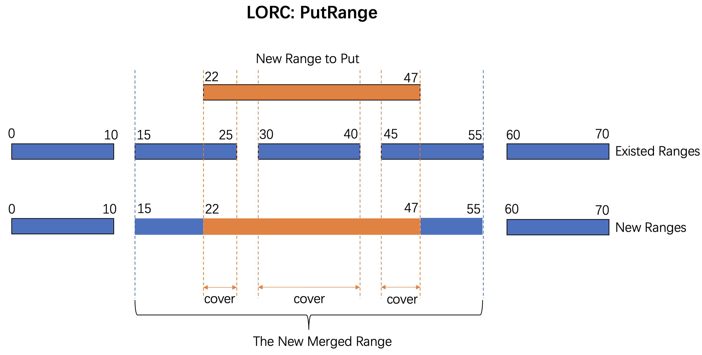

## LorcKV
LorcKV (Logically Ordered Range Cache). 
Aiming to utilize in-memory cache component to overcome the performance problem of range query in the KV separation scenario. 
A fork of rocksdb(BlobDB). 

The LORC component takes ranges as the basic unit to cache range data. It minimizes unnecessary memory copies to improve memory efficiency.

Current demo implementation: ./lorc/

To be done.