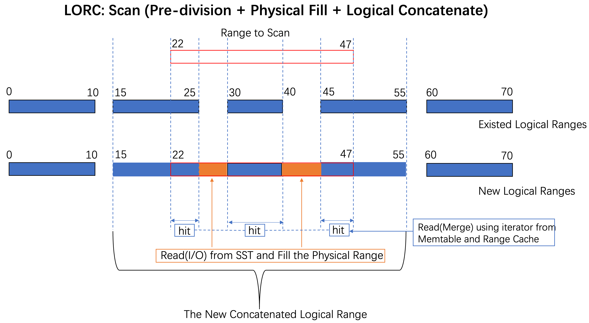

## LorcKV
LorcKV (Logically Ordered Range Cache). 

Aiming to utilize in-memory cache component to overcome the performance problem of range query, especially in the KV separation scenario. 
A fork of RocksDB(BlobDB). 

The LORC component takes ranges as the basic unit to cache range data, while the outer logical ranges represent the global view. It minimizes unnecessary memory copies to improve memory efficiency.

To be done.